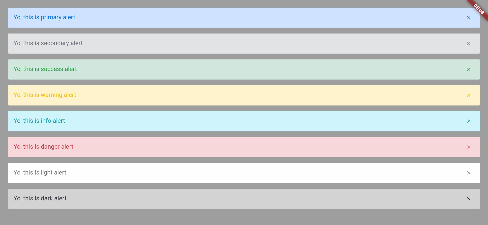
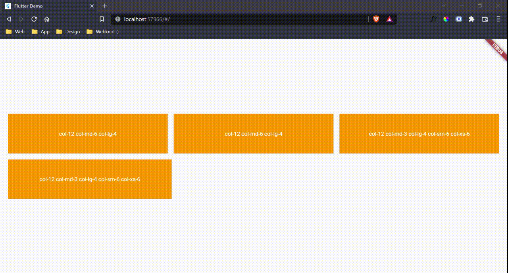
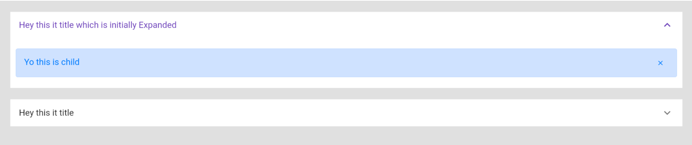
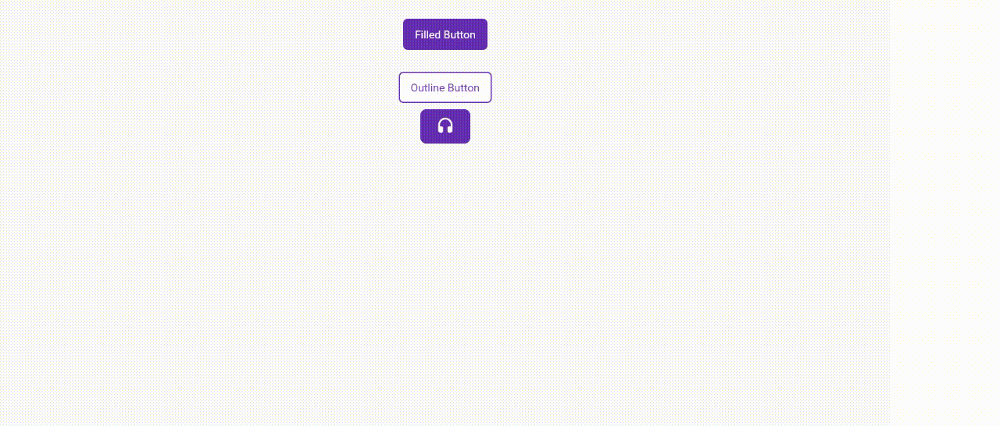
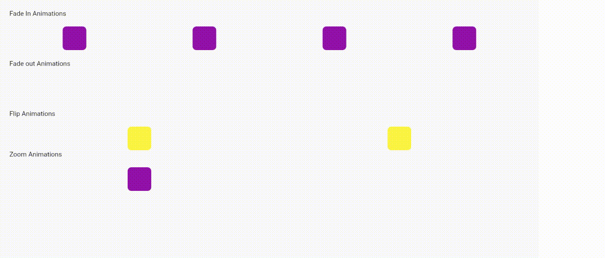

# Flutter Next

<a href="https://www.buymeacoffee.com/shashiben" target="_blank"></a>

[](https://pub.dev/packages/flutter_next)
[](https://opensource.org/licenses/MIT)
<a href="https://github.com/shashiben/flutter_next"></a>
<a href="https://github.com/shashiben/flutter_next"></a>
<br>
<br>

<p  align="center">

<br>
<b>Now build flutter apps with ease and responsive.</b>
</p>
<br>

An advanced flutter package to build responsive application accross all platform with ease and has an handful of different types of extension.

- [Alerts](#alerts)
- [Grid System](#grid-system)
- [Accordion](#accordion)
- [Button](#button)
- [Animations](#animations)
- [Extensions](#extensions)

## Alerts

Define an alert by:

```dart
  NextAlert(
    child: Text("Yo, this is primary alert"),
    onClosedIconPressed: () {},
    margin: EdgeInsets.only(bottom: 15),
  ),
```

You can use multiple variant of alerts

```dart
  NextAlert(
    variant: NextVariant.secondary,
    child: Text("Yo, this is primary alert"),
    onClosedIconPressed: () {},
    margin: EdgeInsets.only(bottom: 15),
  ),
```

And you can even define custom,variant should be custom

```dart
 NextAlert(
    variant: NextVariant.custom,
    customConfigs: NextAlertColorUtils(
      borderColor: Colors.black,
      backgroundColor: Colors.pink,
      color: Colors.deepOrange,
    ),
    child: Text("Yo, this is primary alert"),
    onClosedIconPressed: () {},
    margin: EdgeInsets.only(bottom: 15),
  ),
```



## Grid System

<table class="table table-bordered table-striped">
  <thead>
    <tr>
      <th></th>
      <th class="text-center">
        Extra small<br>
        <small>&lt;576px</small>
      </th>
      <th class="text-center">
        Small<br>
        <small>≥576px</small>
      </th>
      <th class="text-center">
        Medium<br>
        <small>≥768px</small>
      </th>
      <th class="text-center">
        Large<br>
        <small>≥992px</small>
      </th>
      <th class="text-center">
        Extra large<br>
        <small>≥1200px</small>
      </th>
    </tr>
  </thead>
  <tbody>
    <tr>
      <th class="text-nowrap" scope="row">Max container width</th>
      <td>None (auto)</td>
      <td>540px</td>
      <td>720px</td>
      <td>960px</td>
      <td>1140px</td>
    </tr>
    <tr>
      <th class="text-nowrap" scope="row">Class prefix</th>
      <td><code>.col-</code></td>
      <td><code>.col-sm-</code></td>
      <td><code>.col-md-</code></td>
      <td><code>.col-lg-</code></td>
      <td><code>.col-xl-</code></td>
    </tr>
  </tbody>
</table>

```dart
NextRow(
  verticalSpacing: 15,
  horizontalSpacing: 15,
  children: [
    "col-12 col-md-6 col-lg-4",
    "col-12 col-md-6 col-lg-4",
    "col-12 col-md-3 col-lg-4 col-sm-6 col-xs-6",
    "col-12 col-md-3 col-lg-4 col-sm-6 col-xs-6"
  ]
      .map((e) => NextCol(
          sizes: e,
          child: Container(
            height: 100,
            decoration: BoxDecoration(color: Colors.orange),
            child: Center(
              child: Text(
                e,
                textAlign: TextAlign.center,
                style: TextStyle(color: Colors.white),
              ),
            ),
            width: double.infinity,
          )))
      .toList())
```



## Accordion

```dart
 NextAccordion(
    initiallyExpanded: true,
    backgroundColor: Colors.white,
    collapsedBackgroundColor: Colors.white,
    title: Text("Hey this it title which is initially Expanded"),
    children: [
      Padding(
        padding: EdgeInsets.symmetric(vertical: 20, horizontal: 10),
        child: NextAlert(
          child: Text("Yo this is child"),
        ),
      )
    ],
  ),
```



## Button



You can customise button by using itemBuilder

```dart
   NextButton(
    onPressed: () {},
    style: TextStyle(color: Colors.white),
    child: Text(
      "Filled Button",
      style: TextStyle(color: Colors.white),
    ),
  ),
  SizedBox(height: 20),
  NextButton(
    onPressed: () {},
    variant: NextButtonVariant.outlined,
    child: Text("Outline Button"),
  ),
  NextButton(
    onPressed: () {},
    variant: NextButtonVariant.outlined,
    itemBuilder: (context, isHovered, color) =>
        Icon(Icons.headset_rounded, color: color)
            .paddingSymmetric(horizontal: 20, vertical: 10)
            .decoration(BoxDecoration(
              border:
                  Border.all(color: context.primaryColor, width: 1.5),
              color: !isHovered ? context.primaryColor : Colors.white,
              borderRadius: BorderRadius.circular(8),
            )),
  )
```

- the param color in itemBuilder is a color tween between color and outline color provided in button

## Animations



```dart
 Text("Fade In Animations").customPadding(bottom: 20),
  Row(
    mainAxisAlignment: MainAxisAlignment.spaceAround,
    children: [
      ContainerThing().fadeIn(
          variant: NextFadeInVariant.fadeInLeft,
          duration: Duration(milliseconds: 600)),
      ContainerThing().fadeIn(
          variant: NextFadeInVariant.fadeInTop,
          duration: Duration(milliseconds: 600)),
      ContainerThing().fadeIn(
          variant: NextFadeInVariant.fadeInBottom,
          duration: Duration(milliseconds: 600)),
      ContainerThing().fadeIn(
          variant: NextFadeInVariant.fadeInRight,
          duration: Duration(milliseconds: 600)),
    ],
  ),
  SizedBox(height: 20),
  Text("Fade out Animations").customPadding(bottom: 20),
  Row(
    mainAxisAlignment: MainAxisAlignment.spaceAround,
    children: [
      ContainerThing(
        color: Colors.red,
      ).fadeOut(
          variant: NextFadeOutVariant.fadeOutLeft,
          duration: Duration(milliseconds: 600)),
      ContainerThing(
        color: Colors.red,
      ).fadeOut(
          variant: NextFadeOutVariant.fadeOutTop,
          duration: Duration(milliseconds: 600)),
      ContainerThing(
        color: Colors.red,
      ).fadeOut(
          variant: NextFadeOutVariant.fadeOutBottom,
          duration: Duration(milliseconds: 600)),
      ContainerThing(
        color: Colors.red,
      ).fadeOut(
          variant: NextFadeOutVariant.fadeOutRight,
          duration: Duration(milliseconds: 600)),
    ],
  ),
  SizedBox(height: 20),
  Text("Flip Animations").customPadding(bottom: 20),
  Row(
    mainAxisAlignment: MainAxisAlignment.spaceAround,
    children: [
      ContainerThing(
        color: Colors.yellow,
      ).flip(
          variant: NextFlipVariant.flipX,
          duration: Duration(milliseconds: 600)),
      ContainerThing(
        color: Colors.yellow,
      ).flip(
          variant: NextFlipVariant.flipY,
          duration: Duration(milliseconds: 600)),
    ],
  ),
  SizedBox(height: 20),
  Text("Zoom Animations").customPadding(bottom: 20),
  Row(
    mainAxisAlignment: MainAxisAlignment.spaceAround,
    children: [
      ContainerThing().zoom(variant: NextZoomVariant.zoomIn),
      ContainerThing().zoom(variant: NextZoomVariant.zoomOut),
    ],
  )
```

## Extensions

Now access themedata and mediaquery data easily like

```dart
  context.themeData
  context.primaryColor
  context.backgroundColor
```

And for widgets

```dart
// Just center like this
Container(
  child:....
).center()

//Now you can use column/row/stack like this
[WIdget1(),WIdget2(),WIdget3()].column()
```
